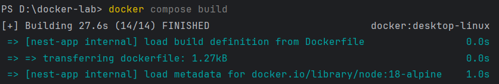
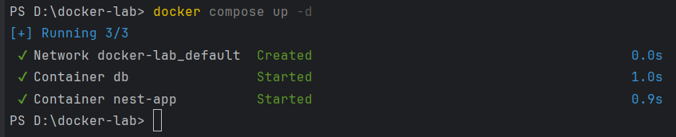

<h1>Лабораторная работа "Docker: докеризация приложения"</h1>
<h2>Задание</h2>
<p>
Цель лабораторной: собрать из исходного когда и запустить в докере рабочее приложение с базой данных (любое опенсорс - Java, python/django/flask, golang).

1. Образ должен быть легковесным
2. Использовать базовые легковесные образы - alpine
3. Вся конфигурация приложения должна быть через переменные окружения
4. Статика (зависимости) должна быть внешним томом `volume`
5. Создать файл `docker-compose` для старта и сборки
6. В `docker-compose` нужно использовать базу данных (postgresql,mysql,mongodb etc.)
7. При старте приложения должно быть учтено выполнение автоматических миграций
8. Контейнер должен запускаться от непривилегированного пользователя
9. После установки всех нужных утилит, должен очищаться кеш
</p>
<h2>Выполнение работы</h2>

**1)** Было написано приложение на NestJS, PostgreSQL подключена через TypeORM. \
В приложении описан сервис для управления пользователями и определена сущность 
пользователя User для работы с бд с использованием TypeORM. \
Также реализован контролер для связи маршрутов с методами сервиса.

**2)** Для генерации миграций был написан файл конфигурации `typeorm.config.ts`, 
чтобы сгенерировать новую миграцию нужно использовать команду `npm run migration:generate`, 
миграции будут сгенерированы в папке `src/migrations`. 
Для выполнения всех сгенерированных миграций нужно использовать `npm run migration:run`

**3)** Dockerfile
```
FROM node:18-alpine

RUN addgroup -S appgroup && adduser -S appuser -G appgroup

WORKDIR /usr/src/app

COPY package*.json ./

RUN npm install && rm -rf /tmp/*

COPY . .

RUN npm run build

USER appuser

EXPOSE 3000

CMD ["sh", "-c", "npm run migration:run && npm run start:prod"]
```
Файл описывает процесс создания Docker-образа приложения
- Используется базовый легковесный образ `node:18-alpine`
- Создается группа для непривилегированного пользователя 
и в нее добавляется пользователь
- Устанавливает рабочая директория, 
копируются `package.json` и `package-lock.json` в контейнер, 
далее устанавливаются все зависимости и удаляется временный кеш
- Все файлы проекта кроме файлов указанных в `.dockerignore` копируются в рабочую директорию
- Выполняется команда сборки приложения и переход на непривилегированного пользователя
- Устанавливается порт для приложения
- При запуске контейнера выполняются миграции бд и запускается приложение

**4)** docker-compose.yaml
```
services:
  nest-app:
    container_name: nest-app
    image: asdil/nest-app:latest
    build:
      context: .
    ports:
      - "3000:3000"
    environment:
      DB_TYPE: postgres
      PG_HOST: db
      PG_PORT: 5432
      PG_USERNAME: postgres
      PG_PASSWORD: postgres
      PG_DATABASE: postgres
    depends_on:
      - db
  db:
    container_name: db
    image: postgres:17.2-alpine
    ports:
      - "5432:5432"
    environment:
      POSTGRES_USER: postgres
      POSTGRES_PASSWORD: postgres
      POSTGRES_DB: postgres
    volumes:
      - postgres_data:/var/lib/postgresql/data
volumes:
  postgres_data: {}
```
1. В файле описана конфигурация для запуска контейнеров
   - services - список сервисов, которые нужно запустить
   - volumes - тома для хранения данных 
2. Сервис nest-app
   - задается имя контейнера
   - используется Dockerfile для сборки образа
   - пробрасывается порт 3000 контейнера на порт 3000 хоста 
   - задаются переменные окружения для подключения к бд
   - `depends_on` указывает, что сервис должен запускаться после старта сервиса db
3. Сервис db
   - задается имя контейнера
   - используется легковесный образ PostgreSQL
   - пробрасывается порт 5432 контейнера на порт 5432 хоста
   - настраиваются учетные данные и имя бд через переменные окружения
   - для хранения данных используется том postgres_data
4. Тома volumes
   - postgres_data - имя тома

**5)** Для сборки образов выполняем команду `docker compose build`



**6)** Для запуска контейнеров выполняем команду `docker compose up -d`



**7)** Проверим с помощью Postman корректную работу
-  Выполним POST запрос для добавления пользователя, в теле запроса укажем данные пользователя
```
{
    "username": "aaa",
    "email": "aaa@gmail.com"
}
```
- Выполним GET запрос на localhost:3000/users/1
```
{
  "id": 1,
  "username": "aaa",
  "email": "aaa@gmail.com"
}
```
- Добавим еще нескольких пользователей и выполним запрос для получения всех пользователей
```
[
    {
        "id": 1,
        "username": "aaa",
        "email": "aaa@gmail.com"
    },
    {
        "id": 2,
        "username": "bbb",
        "email": "bbb@gmail.com"
    },
    {
        "id": 3,
        "username": "ccc",
        "email": "ccc@gmail.com"
    }
]
```